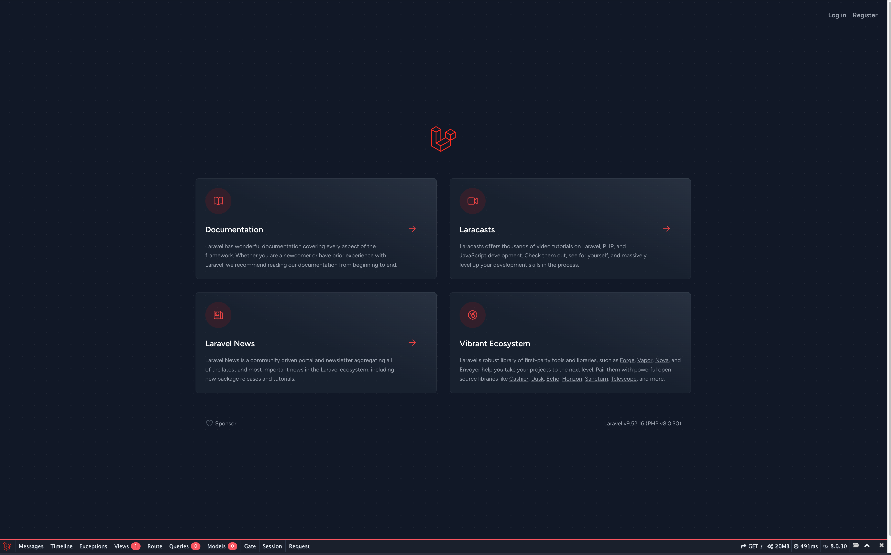
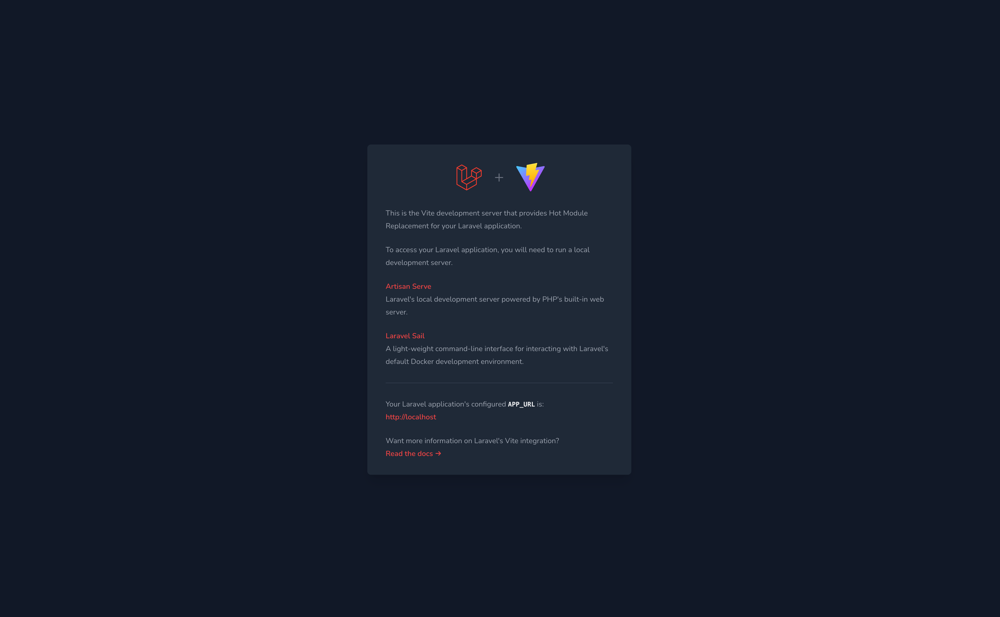

# LaraBreezeDockerKit

## Outline

Laravel Breeze（Inertia）で構築された環境キットです。<br>
フロントには Vue を導入しています。

## Architecture


## Requirement

-   nginx: latest
-   php: 8.0.0
-   MySQL: 8.0.26
-   Laravel9
-   vue@3.3.10

```shell
$ docker -v
Docker version 24.0.6, build ed223bc
```

```shell
$ docker-compose -v
Docker Compose version v2.21.0-desktop.1
```

## Docker-compose build

```shell
$ docker-compose build --no-cache
```

```shell
$ docker images
REPOSITORY             TAG       IMAGE ID       CREATED         SIZE
laraveldockerkit-php   latest    xxxxxxxxxxxx   2 minutes ago   483MB
```

## Docker-compose up

```shell
$ docker-compose up -d
```

```shell
$ docker-compose ps
NAME                            IMAGE                   COMMAND                                                                               SERVICE      CREATED          STATUS          PORTS
laraveldockerkit-mysql-1        mysql:8.0.26            "docker-entrypoint.sh mysqld --default-authentication-plugin=mysql_native_password"   mysql        57 seconds ago   Up 56 seconds   3306/tcp, 33060/tcp
laraveldockerkit-nginx-1        nginx:1.21.1            "/docker-entrypoint.sh nginx -g 'daemon off;'"                                        nginx        56 seconds ago   Up 55 seconds   0.0.0.0:80->80/tcp
laraveldockerkit-php-1          laraveldockerkit-php    "docker-php-entrypoint php-fpm"                                                       php          57 seconds ago   Up 56 seconds   9000/tcp
laraveldockerkit-phpmyadmin-1   phpmyadmin/phpmyadmin   "/docker-entrypoint.sh apache2-foreground"                                            phpmyadmin   56 seconds ago   Up 55 seconds   0.0.0.0:8080->80/tcp
```

## Docker-compose stop

```shell
$ docker-compose stop
```

```shell
$ docker-compose ps -a
NAME                            IMAGE                   COMMAND                                                                               SERVICE      CREATED          STATUS                      PORTS
laraveldockerkit-mysql-1        mysql:8.0.26            "docker-entrypoint.sh mysqld --default-authentication-plugin=mysql_native_password"   mysql        28 minutes ago   Exited (0) 38 seconds ago
laraveldockerkit-nginx-1        nginx:1.21.1            "/docker-entrypoint.sh nginx -g 'daemon off;'"                                        nginx        28 minutes ago   Exited (0) 40 seconds ago
laraveldockerkit-php-1          laraveldockerkit-php    "docker-php-entrypoint php-fpm"                                                       php          28 minutes ago   Exited (0) 40 seconds ago
laraveldockerkit-phpmyadmin-1   phpmyadmin/phpmyadmin   "/docker-entrypoint.sh apache2-foreground"                                            phpmyadmin   28 minutes ago   Exited (0) 39 seconds ago
```

## Docker-compose down

```
$ docker-compose down --rmi all --volumes
```

```
$ docker-compose ps
Name   Command   State   Ports
------------------------------
```

```
$ docker image ls
REPOSITORY   TAG       IMAGE ID   CREATED   SIZE
```

## Setup Instructions

1.  リポジトリをクローンします。

    ```bash
    git clone git@github.com:yahiro0110/LaraBreezeDockerKit.git
    ```

2.  環境変数用のファイルを用意します。

    ```bash
    cp ./src/.env.example ./src/.env
    ```

3.  .env ファイル内のデータベース接続設定を次のように書きかえてください。

    ```markdown
    DB_CONNECTION=mysql
    DB_HOST=db
    DB_PORT=3306
    DB_DATABASE=mysql_db
    DB_USERNAME=admin
    DB_PASSWORD=secret
    ```

4.  Docker コンテナを起動します。

    ```bash
    docker-compose up -d --build
    ```

5.  PHP コンテナへログインし、Laravel アプリケーションの準備をします。

    ```bash
    # PHPコンテナへのログイン
    docker-compose exec php bash

    # Laravelアプリケーションの依存関係をインストール
    composer update

    # アプリケーションキーの生成
    php artisan key:generate

    # npmのインストール
    npm install

    #　開発サーバの実行
    npm run dev
    ```

6.  次の URL にアクセスし、画面が表示されていれば成功です。

    http://localhost

    

    http://localhost:5173

    

## phpMyAdmin

http://localhost:8080

## troubleshooting

<details>
<summary>発生した問題と解決策はこちら</summary>

### php artisan key:generate を実行したときにエラーが発生した

-   [発生した事象の詳細](https://chat.openai.com/share/38def75e-481f-4f04-9983-f5acce22323a)

</details>

## additional information

### １．Vue.js でデバックをおこなう場合

Vue.js でデバックをおこなう際は、先にデバック機能を実行してからブレークポイントを設定すること。<br>
ブレークポイントを設定してからデバックを実行しても設定した箇所に止まらない。

## Reference

## Changelog

<details>
<summary>更新内容はこちら</summary>

### 1.0.0 （2023/09/25）

-   初回登録

</details>
